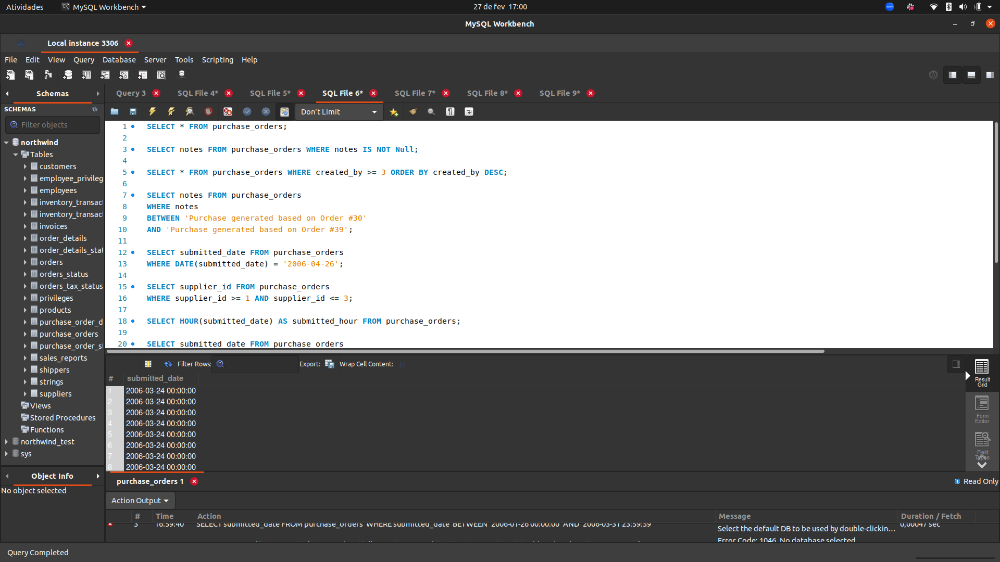

<h2>Bem vindo e Bem vinda</h2>
<h3>Repositório do MySQL All For One</h3>

Construí esse projeto como parte do do curso de desenvolvimento web na <a href="https://www.betrybe.com/" target="_blank" alt="Trybe">Trybe</a>

<h3>Propósito do projeto</h3>

Montar diversas queries de acordo com o solicitado. Algumas delas foram ordenar dados e limitá-los à uma certa quantidade, concatenar dados de duas diferentes colunas e nomear, contar quantidade de ocorrências de acordo com o filtro e até inserir, atualizar e deletar dados da tabela.

O mais desafiados foi o receio de fazer um update ou delete sem estar de acordo com o solicitado. Procurei sempre fazer um SELECT com o filtro antes para garantir que vou atualizar e/ou deletar os dados corretamente.

<h3>Visual do projeto</h3>

Fico à disposição para contato, sugestões e feedbacks sobre o projeto.
